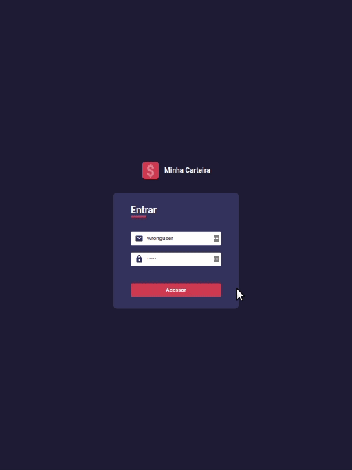
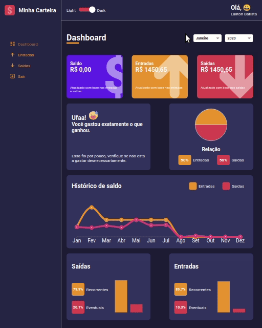
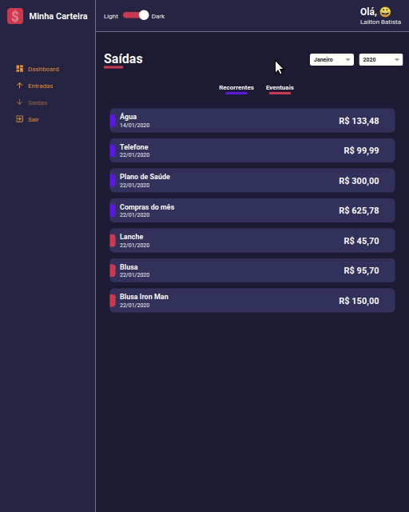
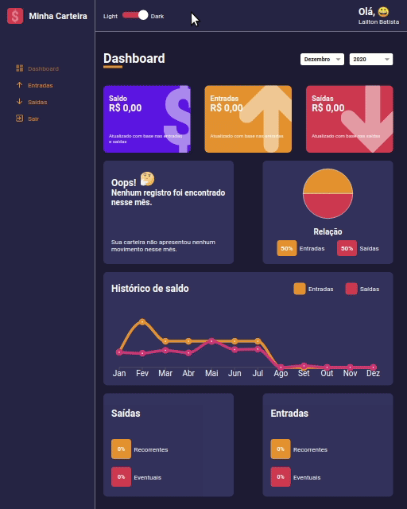

<h1 align="center">

 
My Wallet
</h1>
<h2 align="center">
This application simulates a wallet with all your history of gains and loss for each month and year.
</h2>

There is no database on this application, all data is fake.

 

  

<h2>Account</h2>

  E-mail: user@mail.com | 
  Password: user

 

  

<h2>Wallet</h2>
 

  

<h2>List of gains (Entradas) and loss (Saídas)</h2>

There are filters of eventual (Eventuais) and recurrent (Recorrentes) gains/loss

 

  

<h2>Dark Mode & Light Mode</h2>
 

  

  

## Technologies

This project was developed with the following technologies:

- [ReactJS](https://reactjs.org/)
- [typescript](https://www.typescriptlang.org/)
- [styled-components](https://www.styled-components.com/)
- [react-router-dom](https://reactrouter.com/)
- [recharts](https://recharts.org/en-US/)
- [react-countup](https://www.npmjs.com/package/react-countup)
- [react-icons](https://react-icons.github.io/react-icons/)
- [react-switch](https://www.npmjs.com/package/react-switch)
